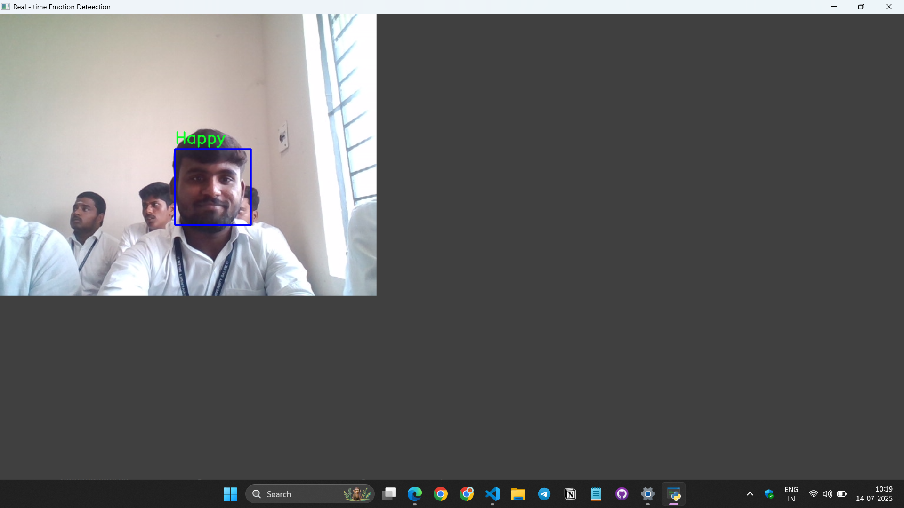

# Real-Time Emotion Detection with CNN and OpenCV

## 🧠 Project Overview

This project is a real-time emotion detection system that uses a Convolutional Neural Network (CNN) to classify facial expressions captured through a webcam. The model is trained on the FER-2013 dataset and recognizes **7 emotions**:

- Angry
- Disgust
- Fear
- Happy
- Sad
- Surprise
- Neutral

Facial detection is handled using OpenCV's Haar Cascade classifier.

---

## 🚀 Tech Stack

- Python 3.10
- TensorFlow 2.10 (GPU)
- OpenCV 4.6.0.66
- Keras
- NumPy, Matplotlib, Pandas
- Jupyter Notebooks
- Haar Cascade Classifier for face detection

---

## 📁 Directory Structure

```
emotion_detection/
├── app.py                     # Real-time detection app
├── models/
│   └── emotion_model.h5      # Trained CNN model
├── haarcascade/
│   └── haarcascade_frontalface_default.xml
├── src/
│   └── cnn_model.py          # CNN architecture
├── notebooks/
│   ├── 01_preprocessing.ipynb
│   └── 02_train_model.ipynb
├── dataset/                  # FER-2013 dataset folders (train/test)
├── screenshots/              # Demo images/GIFs
│   └── demo.png
└── README.md
```

---

## 🧪 How to Run the Project

### 1. Clone the Repo

```bash
git clone https://github.com/Dhayanidhi-96/emotion-detection-cnn-opencv.git
cd emotion-detection-cnn-opencv
```

### 2. Set up Virtual Environment (Recommended)

```bash
python -m venv cnn_gpu_env
cnn_gpu_env\Scripts\activate     # Windows
```

### 3. Install Dependencies

```bash
pip install -r requirements.txt  # Make sure this file lists your packages
```

### 4. Train the Model (Optional)

If you'd like to retrain the model:

```bash
jupyter notebook notebooks/02_train_model.ipynb
```

### 5. Run the Real-Time App

```bash
python app.py
```

> Press **'q'** to quit the webcam stream.

---

## 🧊 Model Details

- Architecture: 3 Conv Blocks → Flatten → Dense(128) → Dropout → Output
- Loss Function: `categorical_crossentropy`
- Optimizer: `adam`
- Accuracy Achieved: \~56% on FER-2013 (baseline, can be improved)

---

## 📸 Screenshots




---

## 💡 Future Improvements

- Use MobileNetV2 or ResNet-based model for better accuracy
- Integrate with a web app using Flask or Streamlit
- Deploy using Docker (next step)

---

## 📬 Contact

**Dhayanidhi P**\
📧 [LinkdIn Profile](https://www.linkedin.com/in/dhayanidhi-p-3372b0291/)\
📧 [GitHub](https://github.com/Dhayanidhi-96)

---

## ⭐ Give a Star

If you find this project helpful, please consider giving it a ⭐ on GitHub!

---

## 🔐 License

This project is open-source and available under the [MIT License](LICENSE).

